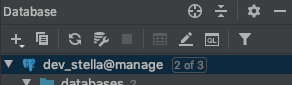
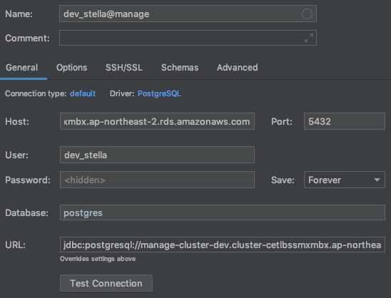

TIL [191212]
=====
## 1.db연결 
> datagrip, intelliJ 둘다 db연결을 해줬어야 했는데, 나는 datagrip에만 연결해둠. 

> 
> </img>
> 1. 기존 설정된 것은 `4번째 연장모양` 아이콘. (data source 창이 뜸)
> 2. 새로운 연결은 1번째 `+` 아이콘으로.
> 3. Host 부분은 구글드라이브 > all파일에 있음 (혹은 AWS Console에 가서 볼 수 있음)
> 4. SQL문 실행하는 법 : 'Console' 창을 띄워야함 
> - 좌측 아래 그림과 같이 '+' 를 클릭 후 'Console'를 선택하는 방법
> - 다른 하나는 'QL' 아이콘을 클릭하여 'Console'을 선택하는 방법
> </img>
> </img>    
> 1-4번 설명/그림 출처: https://freehoon.tistory.com/120 
>```
>* 데이터소스(datasource)란? 
>서버로부터 데이터베이스에 대해 연결을 구축하기 위해 사용하는 이름으로  
>이 이름은 데이터베이스에 쿼리를 만들 때 공통적으로 사용된다. 
>데이터 소스 네임(DSN)은 데이터베이스에 대해 파일명과 동일할 필요는 없다
>```
---

## 2. swagger 주소 숙지
`http://localhost:포트번호/swagger-ui.html#/`

---
## 3. 토큰 받는 주소 숙지 -> swagger
> ex) https://manage-dev.알스**/api/auth/token/오늘날짜와시간

---
## 4. 내 aws 계정
> stella@rsquare.co.kr  
> pw도 재설정 완료

---
## 5. 외워야할 단축키 
```
[ intelli J ]
url로 찾기 : command  + \(backslash)


[ data grip ]
table에서  command + enter => DB에 upload
query에서  command + enter => query 결과 조회

table에서  command + R => DB에 upload
```
---

## 5.url 로  query  찾아가는 법 2가지

> 1. 인텔리제이에서 커맨드+역슬래쉬 로 url  검색하여 소스 진입
> 2. 스웨거에서 콘트롤러 명 보고, 파일명으로 찾기  
> 3. 이후.  커맨드+B 로 definition  따라 들어가면 쿼리.  
---

## 6. 유용한 plugin
> `restful tookit` : url에 해당하는 파일 쉽게 접근  
> `free mybatis` : mybatis를 대체하기위한 아이디어를위한 플러그인
>> - 매퍼 XML 파일 생성
>> - 코드에서 매퍼로, 매퍼에서 코드로 다시 이동
>> - 자동 코드 및 오류 팁
>> - Mybatis 생성기 GUI 지원  

>`idea vim` : 빔 쓰는 사람들을 위한.  

---
## 7. token있는 ID
```
manage > tables > com_user_mst
테이블에서, user_id가 USR000638인 데이터.
```


## 8, 그 외
mybatis mapper xml 파일들의 경고(갈색표시)
>`sql dialect detection` : action으로 검색하면 이 기능을 켜고 끌수있다. 기존에 경고들을 빨갛게 예쁘게 다시 변함.