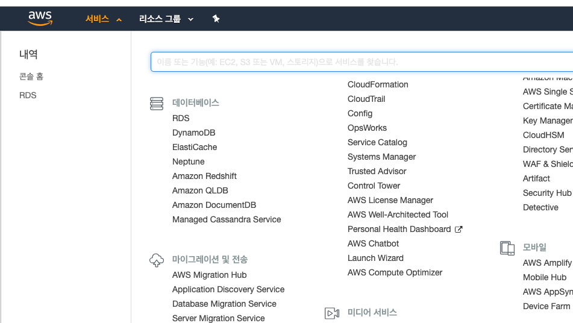
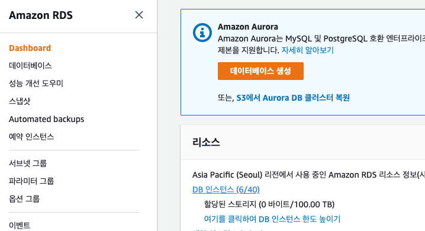
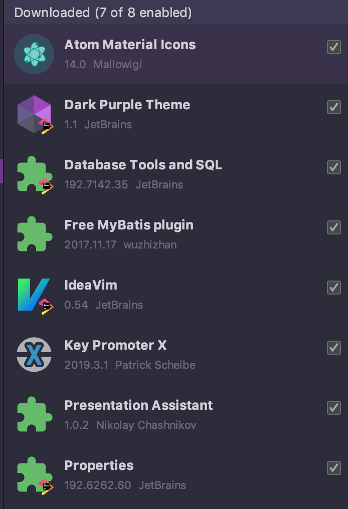

TIL [191213]
=====
## 1. aws console 
> https://aws.amazon.com/ko/console/

- 로그인 후, 상단 `서비스`탭 > `데이터베이스` > `RDS` (Relation Database Service..?) > `DB 인스턴스`

> </img>  
> </img>  
>
- 각 엔드포인트 이름을 보고 싶다면, 각 디비 목록의 링크로 들어가보자.
> `rsquare-cluster` : as-is DB
> `rsquare-devel-cluster` : as-is 계발계 DB
> `*manage-cluster-dev`: 우리가 사용할 manage DB  
>  - 쓰기/읽기 분류되어있는데 읽기전용으론 SELECT만 가능
---
## Datagrip 단축키
- 테이블 스키마 보기
> 1. F1
> 2. 우클릭 후, Modify Table
> 3. command+F6

## 인텔리제이 유용한 Plugin 추가

> </img>  
* icon, theme은 선택옵션.